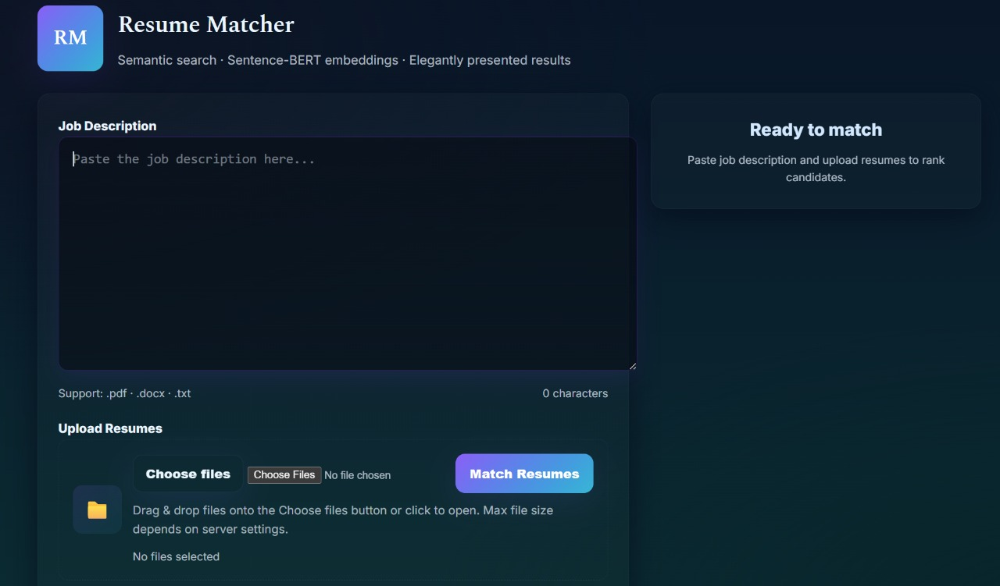
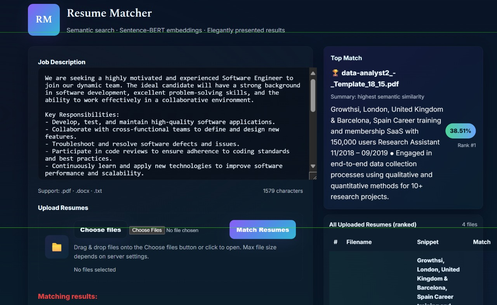
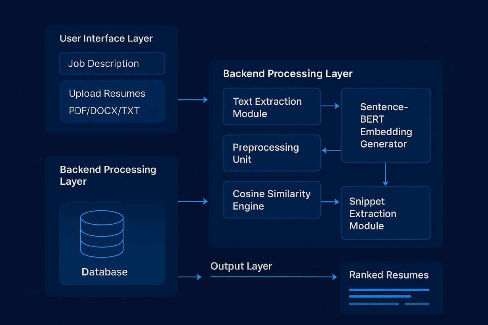

# AI Resume Matcher

An AI-powered Resume Screening and Candidate Ranking System that uses **Natural Language Processing (NLP)** and **Sentence-BERT (SBERT)** to semantically match resumes with job descriptions.

---

## 📌 Project Overview

Traditional Applicant Tracking Systems (ATS) rely mainly on keyword matching, which often fails to identify qualified candidates who use different wording or phrasing. This project solves that problem using transformer-based NLP models.

The system:

- Extracts text from resumes (`PDF`, `DOCX`, `TXT`)
- Cleans and preprocesses text
- Generates semantic embeddings using Sentence-BERT
- Computes similarity between resumes and job descriptions
- Ranks resumes based on relevance
- Highlights top matching snippets from resumes
- Displays results through a Flask-based web interface

---
## 🚀 Project Screenshots

### 📄 Resume Upload & Analysis

<p align="center">
  
</p>

---

### 📊 Resume Match Score & Insights

<p align="center">
  
</p>

---

### 🏗️ Project Architecture Diagram

<p align="center">
  
</p>

---


# 🚀 Features

- ✅ Semantic Resume Matching using SBERT
- ✅ Cosine Similarity-based Ranking
- ✅ Supports PDF, DOCX, and TXT resumes
- ✅ Snippet Highlighting for Explainability
- ✅ TF-IDF fallback model
- ✅ Interactive Flask Web Interface
- ✅ Lightweight and Scalable Architecture
- ✅ Faster Resume Screening Process

---

# 🧠 Technologies Used

| Category | Tools / Libraries |
|---|---|
| Programming Language | Python |
| Web Framework | Flask |
| NLP Model | Sentence-Transformers (SBERT) |
| Text Processing | NLTK, Regex |
| File Parsing | PyPDF2, docx2txt |
| ML Utilities | Scikit-learn, NumPy, Pandas |
| Frontend | HTML, CSS, JavaScript |

---

# 📂 Project Structure

```bash
AI-Resume-Matcher/
│
├── app.py
├── requirements.txt
├── README.md
│
├── resumes/
│
├── templates/
│   └── index.html
│
├── static/
│   ├── style.css
│   └── script.js
│
├── utils/
│   ├── parser.py
│   ├── preprocess.py
│   ├── similarity.py
│   └── snippet_extractor.py
│
└── models/
```

---

# ⚙️ Workflow

1. User enters Job Description
2. User uploads resumes
3. Resume text extraction
4. Text preprocessing
5. Sentence embedding generation using SBERT
6. Cosine similarity calculation
7. Resume ranking
8. Snippet extraction
9. Display ranked results

---

# 🧹 Preprocessing Steps

The system performs several NLP preprocessing operations:

- Lowercasing
- Noise Removal
- Stopword Removal
- Lemmatization
- Sentence Tokenization
- Vectorization using SBERT

---

# 🤖 Algorithms Used

## 1. Sentence-BERT (SBERT)

Used to generate contextual sentence embeddings for resumes and job descriptions.

### Why SBERT?

- Understands semantic meaning
- Captures contextual relationships
- Handles synonyms effectively
- Improves matching accuracy

---

## 2. Cosine Similarity

Measures semantic similarity between resume embeddings and job description embeddings.

### Formula

```math
Cosine Similarity = (A · B) / (||A|| ||B||)
```

Where:

- `A` = Resume embedding vector
- `B` = Job description embedding vector

Similarity score ranges from:

- `0` → No match
- `1` → Perfect match

---

## 3. TF-IDF (Fallback Model)

Traditional NLP-based keyword matching method used as a backup model.

### Advantages

- Lightweight
- Fast
- Easy to implement

### Limitation

- Cannot capture contextual meaning

---

## 4. Snippet Extraction

The system extracts the most relevant sentences from resumes based on local semantic similarity.

This improves:

- Transparency
- Explainability
- Recruiter trust

---

# 📊 Evaluation Metrics

The project evaluates performance using:

- Cosine Similarity Score
- Top-K Accuracy
- Precision & Recall
- Mean Reciprocal Rank (MRR)
- Human Validation
- Processing Lead Time

---

# 🖥️ Installation

## Clone Repository

```bash
git clone https://github.com/your-username/AI-Resume-Matcher.git
cd AI-Resume-Matcher
```

---

## Create Virtual Environment

```bash
python -m venv venv
```

### Activate Environment

#### Windows

```bash
venv\Scripts\activate
```

#### Linux / Mac

```bash
source venv/bin/activate
```

---

## Install Dependencies

```bash
pip install -r requirements.txt
```

---

# ▶️ Run the Application

```bash
python app.py
```

Then open:

```bash
http://127.0.0.1:5000/
```

---

# 📥 Supported Resume Formats

- PDF
- DOCX
- TXT

---

# 📈 Sample Output

| Rank | Resume | Match Score |
|---|---|---|
| 1 | data-analyst2.pdf | 38.51% |
| 2 | data-scientist.pdf | 28.74% |
| 3 | data-analyst.pdf | 28.36% |
| 4 | resume.pdf | 17.07% |

The system also highlights the most relevant sentence snippets from each resume.

---

# 🔍 Comparative Analysis

| Algorithm | Approach | Accuracy | Interpretability |
|---|---|---|---|
| TF-IDF | Keyword Matching | Moderate | Low |
| Cosine Similarity | Vector Comparison | High | Medium |
| SBERT | Semantic Contextual Model | Very High | High |
| Snippet Extraction | Semantic Highlighting | High | Very High |

---

# 📌 Future Enhancements

- Named Entity Recognition (NER)
- Skill Extraction
- Recruiter Feedback Learning
- HR Analytics Dashboard
- Cloud Deployment
- Multilingual Resume Support
- Domain-Specific Fine-Tuning

---

# 👨‍💻 Authors

- **P Sai Eswari**
- **Tejash Kumar G S**

Course: SWE1017 – Natural Language Processing  
Faculty: Dr. B. Saleena

---

# ⭐ Conclusion

This project demonstrates how transformer-based NLP models like Sentence-BERT can significantly improve resume screening and candidate ranking by understanding contextual meaning rather than relying only on keyword matching. The system improves recruitment efficiency, ranking accuracy, and interpretability through semantic matching and snippet highlighting.
